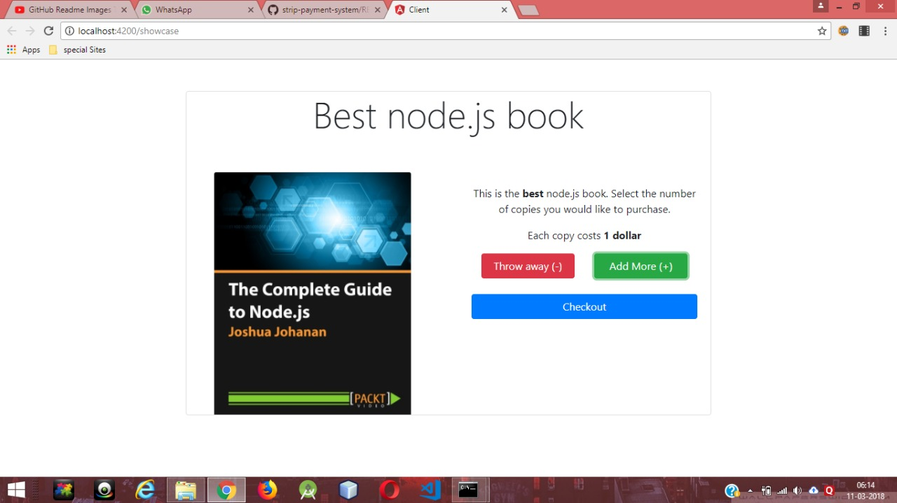
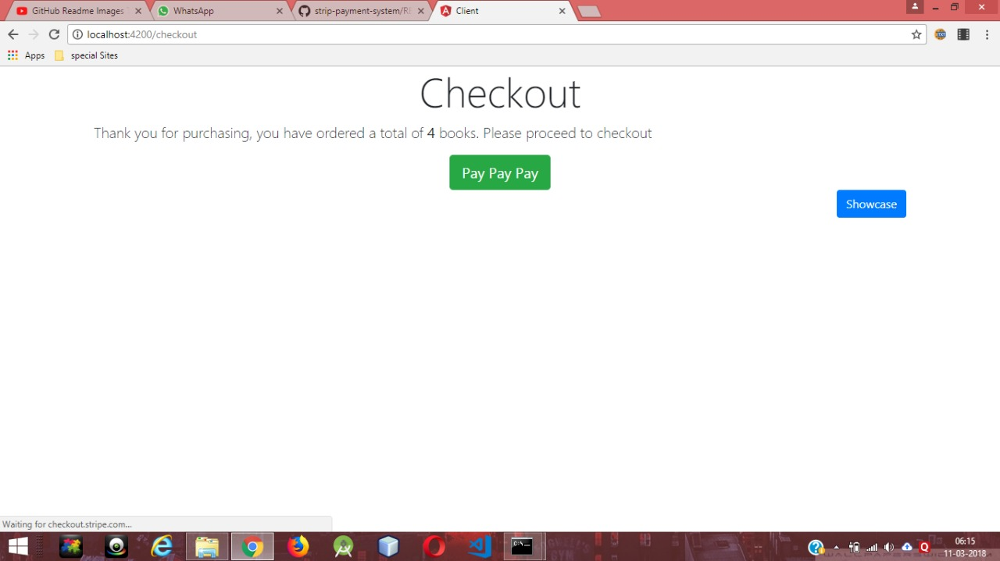
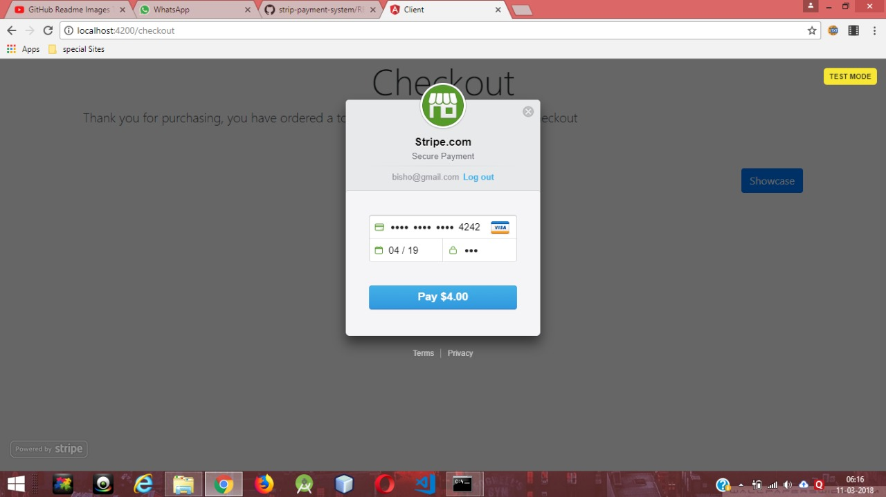
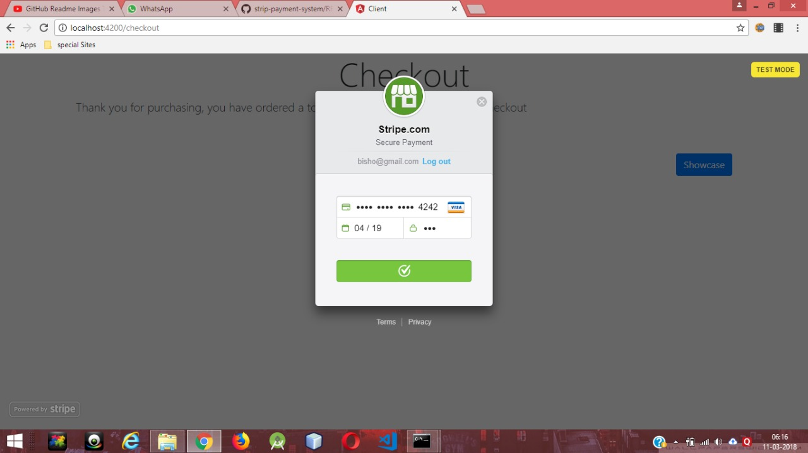
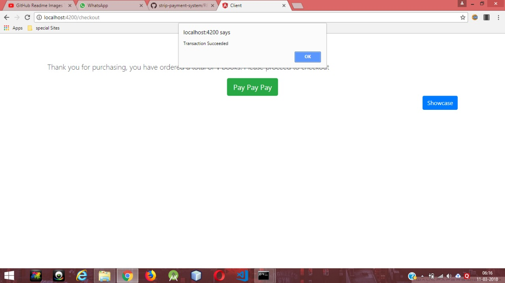
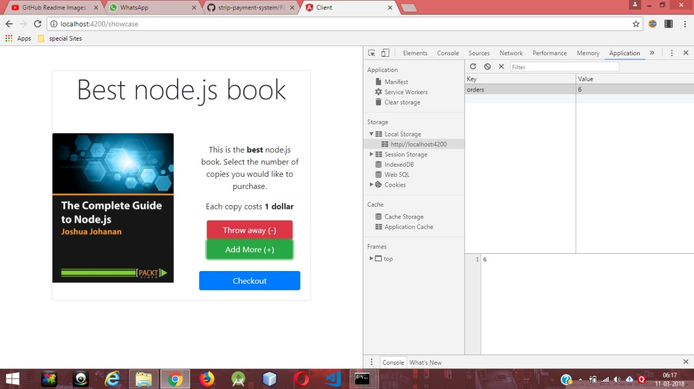

# stripe payment system

## Screenshots

## About App
This app is built using angular 5, typescript, node.js and express. There are two folders in the root directory, client and server. The client has the angular files and the server has the node files. This app also uses the Stripe payment api system which is intrigated in angular for the front end and node, which is used in the backend. 
This app does not store ( yet, as of 11/03/2018 ) the transactions, but this feature can easily be implemented and I have infact made a template ( or interface ) for the same.

### How it works
The client part uses localStorage to keep a track of the orders, otherwise it is not possible to track orders across sessions. After that when the user clicks on the "pay pay pay" button,  a request is sent to the stripe servers and they provide us with a unique token which we can send to our backend for further processing. 
At the backend the server gets the total orders and the token sent by the client. After that the server makes a request to the stripe api to make the transaction happen. If the transaction is successful the server issues a status "success" otherwise the server issues a status "failure".  
Later these transactions can also be stored in the database ( template/interface made but not implemented as of 11/03/2018 ).
